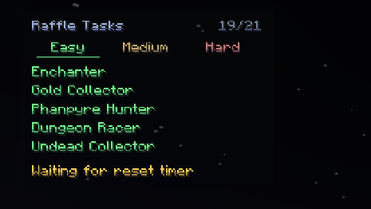
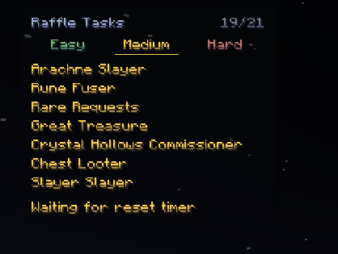
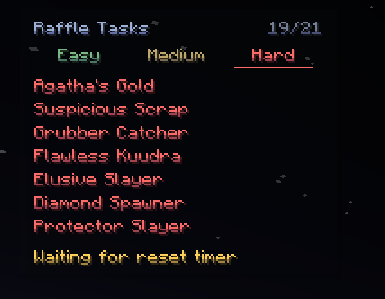

# RaffleTracker

A Hypixel SkyBlock mod that tracks Year 500 Raffle tasks.

## Screenshots

  

## Features

- Displays raffle tasks that arent completed
- Click `Easy`, `Medium`, or `Hard` to switch task tabs.
- Hover a task row to see what the challenge is.
- use /rt move to drag or resize it

## Installation

1. Install [Fabric Loader](https://fabricmc.net/use/installer/) for Minecraft 1.21.11 or 26.1.2
2. Install [Fabric API](https://modrinth.com/mod/fabric-api)
3. Drop the matching `RaffleTracker` jar into your `mods/` folder

## Requirements

- Fabric Loader 0.19.2+ for 1.21.11, or 0.19.3+ for 26.1.2
- Fabric API
